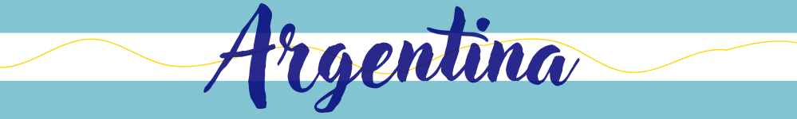

# 🇦🇷 💻Site sobre a Argentina

Este projeto é um site desenvolvido pelo Projeto Volta ao Mundo, com o objetivo de apresentar informações sobre a Argentina, abordando sua cultura, gastronomia, cidades turísticas e história.

## 📸 Preview

## 🌎 Venha Conhecer!
O site apresenta conteúdos sobre: 
📚- Curiosidades Históricas 
💃- Festivais 
🧉- Gastronomia típica 
🏞️- Cidades turísticas 
⚽- Seleção argentina de futebol 

## 🚀 Tecnologias

  
  
  
  
  
  
  

## 🎯 Funcionalidades
▫️ Navbar fixa 
▫️ Cards informativos 
▫️ Layout responsivo 

## 💡 Aprendizados
Este projeto me ajudou a desenvolver habilidades em: 
▫️ Front-end 
▫️ Organização de layout 
▫️ Uso do Bootstrap 

  

